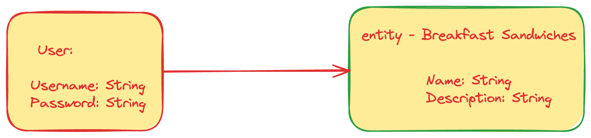

# Seal Project 2

- **Jason Kulak**
- **BSF (Breakfast Sandwich Finder)**
- **Description: This app will help you find great breakfast sandwiches no matter where you are in the U.S./World**
- **Github URL: https://github.com/JasonKulak/Project_2**
- **Deployed Website: https://jk-project-2.onrender.com/**
- **Trello Board: https://trello.com/invite/b/mzv5hVTw/ATTI09d65148ee9921f03063b994700a638f5BB94488/project-2**

## List of Dependencies

##### Node Dependencies (package.json)

- express, dotenv, ejs, method-override, mongoose, morgan, bcrypt, connect-mongo, express-session

##### Frontend (if used, ex. jquery, alpine, bootstrap, htmx, etc.)

- alpine

## Route Map

Below should be a table listing the different routes in your app and their purposes.

|  Route Name |   Endpoint    | Method | Description |
|-------------|---------------|--------|-------------|
|    Index    | /BSF          | GET    | List of breakfast sandwiches
|    New      | /BSF/new      | GET    | Get the new form
|    Destroy  | /BSF/:id      | DELETE | Delete Breakfast sandwich
|    Update   | /BSF/:id      | PUT    | Update one sandwich
|    Create   | /BSF          | POST   | Creates a new sandwich
|    Edit     | /BSF/:id/edit | GET    | Edit existing sandwich
|    Show     | /BSF/:id      | GET    | Gets one sandwich

## Design Mockups (Desktop + Mobile)

##### Mobile Design

##### Desktop Design

## ERD (Entity Relationship Diagram)

